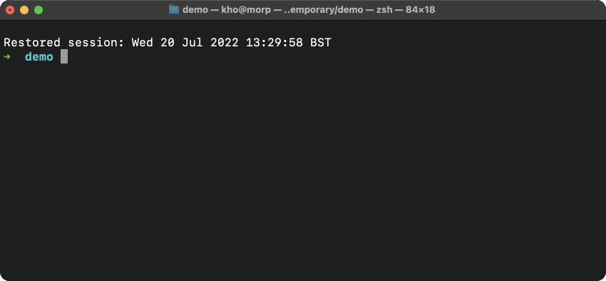

# no_file_limit 📂
A tool to work around annoying file limits on platforms like Discord and WhatsApp.

## How it works 🧩
For the sender, the program will cut files into variably-sized chunks (8MB for Discord, 100MB for WhatsApp), and produce a metadata file for the receiver. All the receiver has to do is open the metadata file, and it will stitch together the original file from the chunks.

## Example 🚀

## Work in progress ⚠️
The program is not ready to use yet.

## TODO 🛠
- [x] Make the slicer
  - [x] Cut files into chunks
  - [x] Generate a metadata file 
  - [x] ~~Neatly~~ refactor it into functions or a struct
  - [ ] [Low priority] Clean up the Slicer struct 📖
- [x] Make the reconstructor
  - [x] Read a metadata file
  - [x] Stitch files back together
  - [ ] [Low priority] Clean up the Glue struct 📖
  - [ ] [Low priority] Think of a better name
- [ ] Fix the poor error handling 🧑‍💻📖
- [ ] Make a decent CLI/TUI experience 🧑‍💻
  - [ ] Use a crate like indicatif to show progress
  - [x] Offer an interactive mode if no flags are set
- [ ] Make a nice GUI